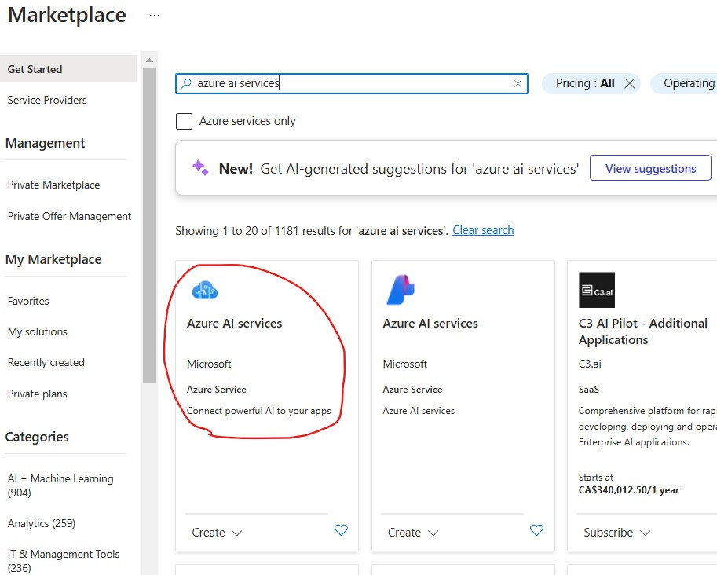
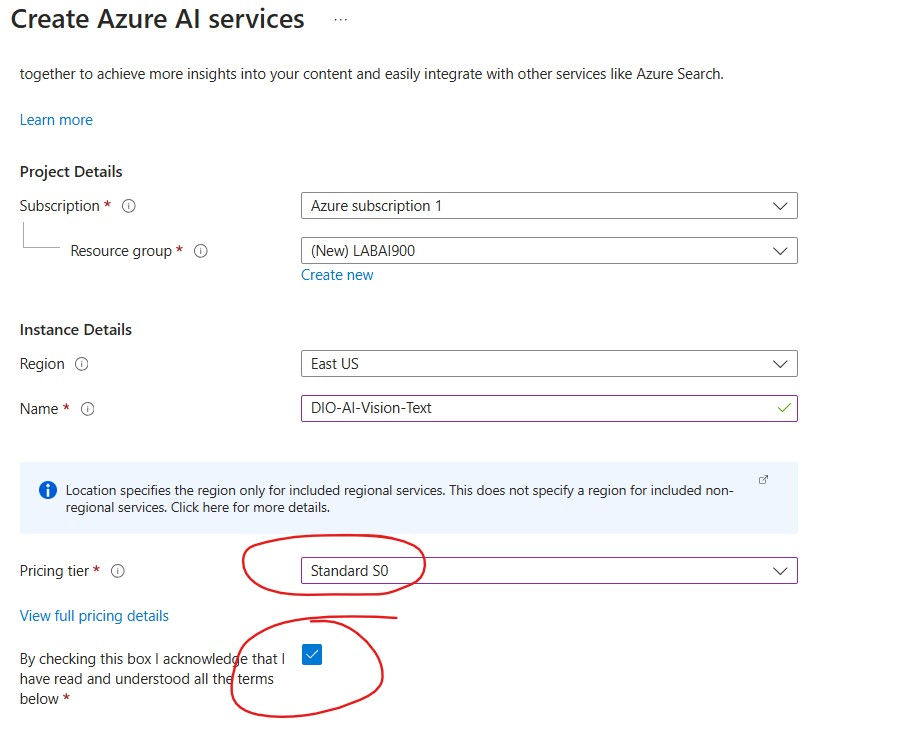
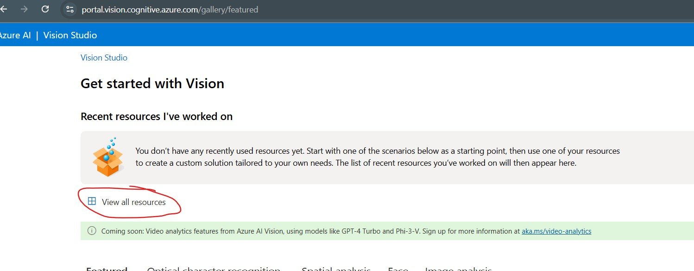
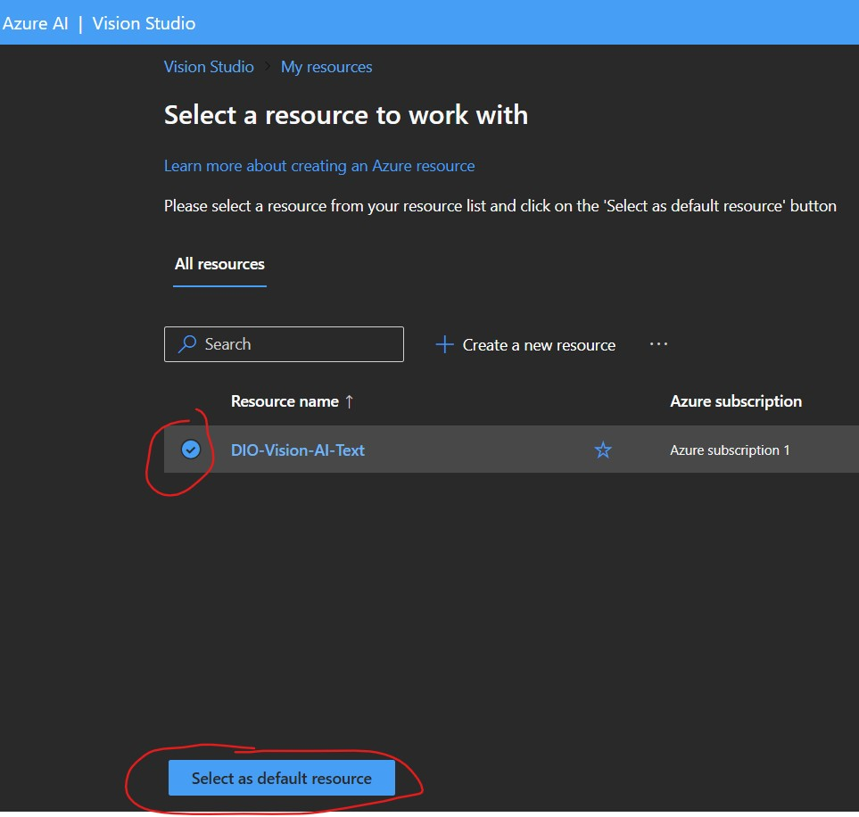
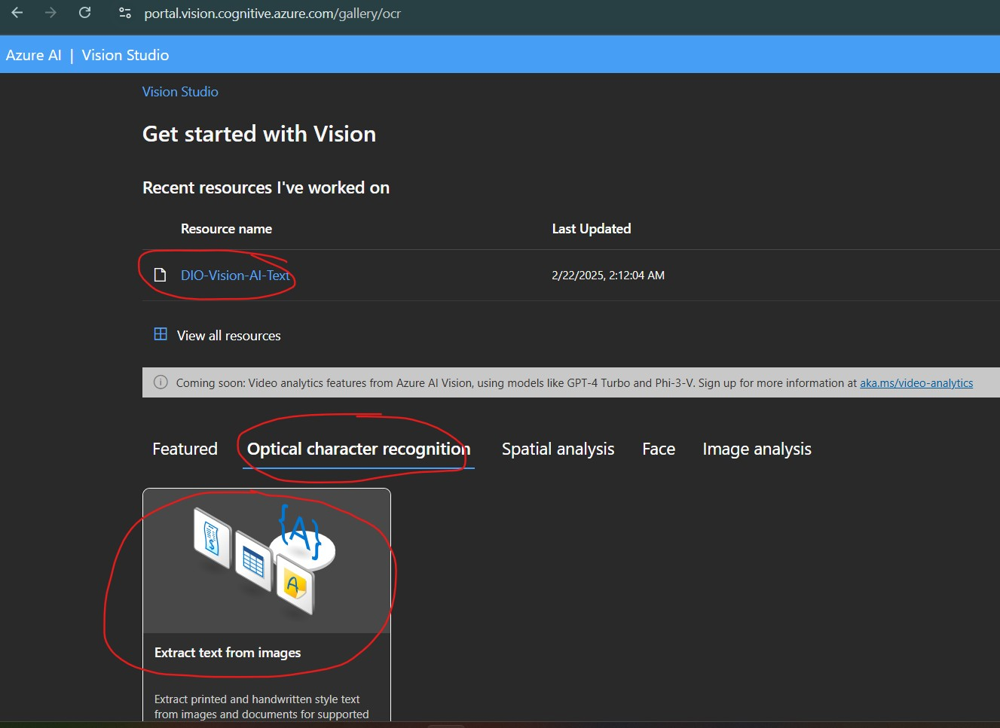
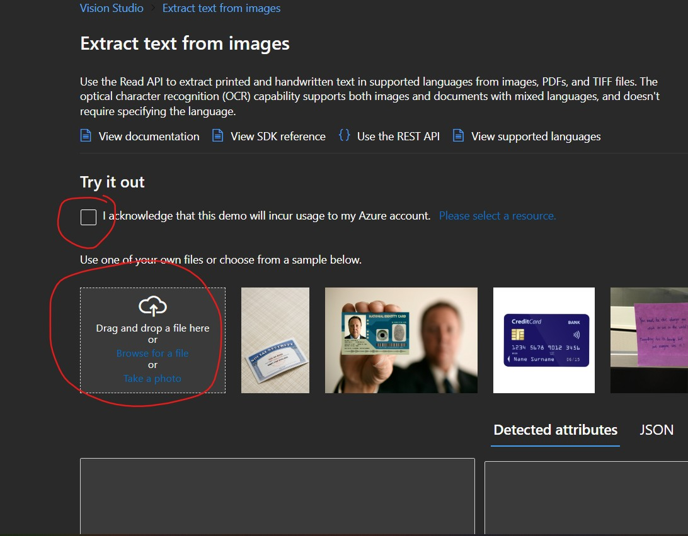
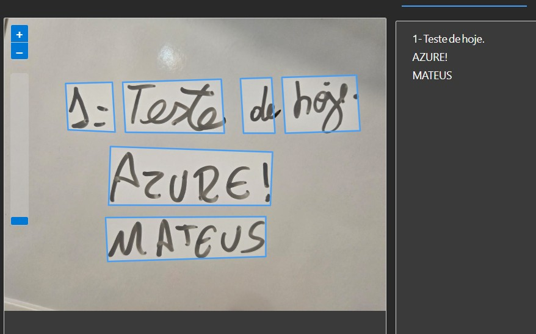
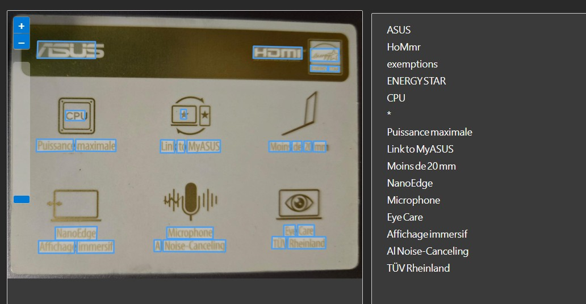

# Azure Vision - Bootcamp DIO

Este repositório documenta minha experiência com o **Azure Vision**, um serviço de inteligência artificial da Microsoft que pode identificar e extrair texto de imagens. Essa atividade faz parte do bootcamp de **Azure IA** da DIO. O aprendizado nessa etapa foi essencial para entender como os sistemas de reconhecimento óptico de caracteres funcionam e como podem ser aplicados para melhorar processos automatizados de digitalização e análise de textos.

---

## Sobre o Projeto

Nessa fase do curso, aprendi como o **Azure Vision** pode ser usado para reconhecer e processar textos em imagens, utilizando a tecnologia chamada **Optical Character Recognition (OCR)**, que significa Reconhecimento Óptico de Caracteres. Essa funcionalidade permite encontrar texto em fotos e documentos escaneados, tornando mais fácil a extração de informações importantes de diferentes fontes visuais.

---

## Etapas do Processo

1. **Criação do recurso no portal do Azure**  
   Para utilizar o Azure Vision, foi necessário primeiro criar um recurso no portal do Azure e configurá-lo corretamente.

3. **Acesso ao portal do Azure Vision**  
   Com o recurso criado, o próximo passo foi acessar a plataforma do Azure Vision para explorar suas funcionalidades.

4. **Configuração do recurso como padrão**  
   Para facilitar os testes e garantir consistência, configurei esse recurso como o padrão para meus experimentos.

5. **Abertura da aba "Optical Character Recognition"**  
   Dentro do Azure Vision, explorei a aba específica de OCR, onde os testes de extração de texto são realizados.

6. **Utilização da ferramenta "Extract Text from Images"**  
   Subir as imagens e clicar que reconhece o uso.
   

8. **Teste com duas imagens:**
   - Foto de palavras escritas em uma lousa, simulando um ambiente de sala de aula.
   - Foto de uma etiqueta do meu notebook, para testar a leitura de textos impressos.

  #### Imagem 1: Lousa e resultado da leitura

#### Imagem 2: Etiqueta do notebook e resultado da leitura

Durante esse processo, observei que o **Azure Vision** apresenta ótimos resultados para textos bem definidos, mas pode enfrentar dificuldades com textos muito distorcidos ou com baixa resolução. Isso ressalta a importância de fornecer imagens de boa qualidade para obter melhores resultados.

---

## Resultados

Os testes mostraram que o **Azure Vision OCR** conseguiu identificar e extrair quase 100% corretamente os textos presentes nas imagens enviadas. Esse processo demonstrou como a tecnologia pode ser útil para converter textos escritos ou impressos em formatos digitais, facilitando a automação de tarefas.

Além disso, percebi que essa ferramenta pode ser aplicada em diversas áreas, como:
- Digitalização de documentos históricos
- Análise de notas fiscais
- Acessibilidade para pessoas com deficiência visual (usando leitores de tela)

Um dos aspectos mais interessantes desse experimento foi perceber que o reconhecimento de caracteres pode variar dependendo da qualidade e do contraste da imagem.

---

## Tecnologias Utilizadas

- **Microsoft Azure**: Plataforma de computação em nuvem que fornece serviços de IA, incluindo o Azure Vision.
- **Azure Vision**: Serviço de análise de imagens que inclui recursos de OCR para extração de textos de imagens.
- **Optical Character Recognition (OCR)**: Tecnologia responsável por converter texto de imagens em dados editáveis.

---

## Conclusão

Aprender a usar o **Azure Vision OCR** foi uma experiência muito interessante. Essa tecnologia pode ser aplicada em diversas áreas, como acessibilidade, automação de processos e análise de documentos. A possibilidade de integrar esse serviço em aplicações do mundo real abre novas oportunidades para tornar tarefas manuais mais eficientes e menos propensas a erros.

Além disso, explorar o funcionamento do OCR me fez perceber a importância da qualidade das imagens para um reconhecimento eficiente. Para casos em que o texto está borrado ou a iluminação não é adequada, é necessário fazer ajustes na imagem antes da análise para obter resultados mais precisos.

No futuro, pretendo testar a integração do **Azure Vision** com outras ferramentas e APIs para criar aplicações que utilizem OCR em tempo real, possibilitando novas formas de interação com imagens e documentos.

---
